# Personal Cognitive Architecture (PCA)

**A modular, AI-augmented knowledge system for capturing, validating, reconciling, and activating knowledge.**

Build your own cognitive infrastructure that captures insights from anywhere, filters intelligently, reconciles with existing knowledge, and outputs actionable intelligence.

---

## System Overview

```mermaid
graph TD
    subgraph INPUT ["🔵 INPUT SOURCES<br/>Multi-modal capture, low-friction ingestion"]
        YT["📺 YouTube"]
        WEB["🌐 Web"]
        CHAT["💬 Chat"]
        VOICE["🎤 Voice"]
        DOCS["📄 Documents"]
        FILES["📁 Files"]
        SHORTCUTS["⚡ iPhone Shortcuts"]
    end

    subgraph CAPTURE ["🔵 CAPTURE LAYER<br/>Ingest and normalize content"]
        WHISPER["🎧 Whisper<br/>Transcription"]
        PLAYWRIGHT["🎭 Playwright<br/>Web Extraction"]
        PARSERS["⚙️ Custom Parsers<br/>Parsing"]
        NORM["📋 Normalization<br/>Text, Metadata"]
    end

    subgraph VALIDATION ["🟢 VALIDATION LAYER<br/>Score and filter for quality & relevance"]
        CRED["✓ Source Credibility"]
        QUAL["⭐ Content Quality"]
        REL["🎯 Relevance Scoring"]
        ALIGN["⚖️ Alignment Scoring"]
    end

    subgraph RECONCILE ["🟣 COGNITIVE RECONCILIATION ENGINE<br/>THE CORE DIFFERENTIATOR<br/>Compare, reconcile, and evolve knowledge"]
        GRAPHCOMP["Graph Comparison<br/>new vs. existing"]
        RELDET["Relationship Detection<br/>R/C/E/I"]
        CONF["Confidence Update<br/>Bayesian + Heuristics"]
        EVOLVE["Model Evolution<br/>Trigger restructuring"]
    end

    subgraph KNOWLEDGE ["🔵 KNOWLEDGE INTEGRATION LAYER<br/>Store, link, and structure long-term memory"]
        OBSIDIAN["📓 OBSIDIAN KNOWLEDGE GRAPH<br/>Nodes • Links • Backlinks • Tags • Properties"]
        CHROMA["🎨 Vector Database - Chroma<br/>Semantic Layer"]
        NEO4J["🕸️ Neo4j - Graph Intelligence<br/>Relationship modeling"]
    end

    subgraph REASONING ["🔵 REASONING & AGENTS LAYER<br/>Think, synthesize, and orchestrate"]
        LLM["🧠 LLMs Tiered<br/>Claude Sonnet • Claude Haiku<br/>Ollama/Qwen2.5-7B • Local"]
        FRAMEWORK["🤖 Agent Framework<br/>MCP-based"]
        RETRIEVAL["🔍 Retrieval<br/>LlamaIndex RAG"]
        TOOLS["🔧 Tools<br/>Custom + API Integrations"]
    end

    subgraph EXECUTION ["🔵 EXECUTION & AUTOMATION LAYER<br/>Trigger actions and run workflows"]
        N8N["n8n - Shared Orchestration<br/>Lane A + Lane B"]
        TASKS["✅ Tasks & To-Dos"]
        API["🔗 API Calls & Integrations"]
        SCHEDULES["⏰ Schedules & Triggers"]
    end

    subgraph OUTPUT ["🔵 OUTPUT GENERATION LAYER<br/>Create high-quality, multi-modal artifacts"]
        PPTX["📊 Presentations<br/>PowerPoint"]
        DOCX["📝 Documents<br/>Word"]
        DASH["📈 Dashboards<br/>Web"]
        AUDIO["🎵 Audio Summaries<br/>MP3"]
    end

    subgraph INFRA ["🔵 INFRASTRUCTURE & DEPLOYMENT<br/>Self-hosted, secure, Canadian"]
        DOCKER["🐳 Docker Containers"]
        COMPOSE["⚙️ Docker Compose<br/>Orchestration"]
        GITLAB["🦊 GitLab<br/>CI/CD & Version Control"]
        BACKUP["☁️ Cloud Backup Canada<br/>Restic + Backblaze B2"]
    end

    subgraph GOVERNANCE ["🔵 GOVERNANCE & ETHICS"]
        PRIVACY["🔒 Privacy & Data Protection"]
        BIAS["⚖️ Bias Detection & Mitigation"]
        HITL["👤 Human-in-the-Loop Gates"]
        AUDIT["📋 Auditability & Logging"]
    end

    INPUT --> CAPTURE
    CAPTURE --> VALIDATION
    VALIDATION --> RECONCILE
    RECONCILE --> KNOWLEDGE
    KNOWLEDGE --> REASONING
    REASONING --> EXECUTION
    EXECUTION --> OUTPUT
    OUTPUT --> INFRA
    INFRA -.-> GOVERNANCE

    style INPUT fill:#e1f5ff
    style CAPTURE fill:#e1f5ff
    style VALIDATION fill:#c8e6c9
    style RECONCILE fill:#f3e5f5
    style KNOWLEDGE fill:#e1f5ff
    style REASONING fill:#e1f5ff
    style EXECUTION fill:#e1f5ff
    style OUTPUT fill:#e1f5ff
    style INFRA fill:#e1f5ff
    style GOVERNANCE fill:#f1f8e9
```



---

## Quick Navigation

### 📚 Documentation
- **[ARCHITECTURE.md](ARCHITECTURE.md)** — Detailed 9-layer architecture breakdown
- **[SPRINT_5_QUICKSTART.md](SPRINT_5_QUICKSTART.md)** — Get Sprint 5 (Validation Layer) running in 45 min
- **[SPRINT_5_VALIDATION_LAYER.md](SPRINT_5_VALIDATION_LAYER.md)** — Complete validation layer spec
- **[SPRINT_5_N8N_SETUP_VALIDATION_LAYER.md](SPRINT_5_N8N_SETUP_VALIDATION_LAYER.md)** — Step-by-step n8n setup
- **[ARCHITECTURAL_REVIEW_REQUEST_OPUS47.md](ARCHITECTURAL_REVIEW_REQUEST_OPUS47.md)** — Full architecture review for feedback

### 🚀 Backend
- **`backend/`** — FastAPI webhook receiver (Sprint 1: Complete)
  - 4 capture endpoints: YouTube, Voice, Chat, Social
  - Neo4j integration
  - Docker Compose setup
  - See `backend/README.md`

### 📁 Captures
- **`Captures/YouTube/`** — YouTube validation reports
- **`Captures/VoiceMemos/`** — Voice memo transcriptions
- **`Captures/Chat/`** — Chat message captures
- **`Captures/Social/`** — Social media captures

---

## What PCA Does

### 1. **Captures** from Anywhere
- YouTube videos, web articles, chat messages, voice memos, documents, files
- One-tap ingestion from iPhone Shortcuts
- Automatic transcription (Whisper), web extraction (Playwright), parsing

### 2. **Validates** Intelligently
- Dual-agent screening (Screening Agent + Critical Agent)
- Scores on 4 dimensions: Credibility, Quality, Relevance, Alignment
- Agreement-driven confidence (disagreement = flag for human review)
- Routes to: **PROMOTE** (integrate), **INBOX** (review), **ARCHIVE** (low relevance)

### 3. **Reconciles** with Existing Knowledge
- Compares new captures against your knowledge graph (Phase 2)
- Detects relationships: Reinforce, Contradict, Expand, Ignore
- Updates confidence scores via Bayesian inference
- Triggers model evolution when needed

### 4. **Stores** in a Knowledge Graph
- Obsidian as canonical knowledge store (human-readable markdown)
- Neo4j for relationship intelligence (graph queries, analysis)
- Vector database (Chroma) for semantic search
- Full audit trail of all decisions

### 5. **Reasons** with AI Agents
- Multi-tier LLMs: Claude (cloud) + Ollama (local)
- Retrieval-Augmented Generation (RAG) for context-aware reasoning
- MCP-based agent framework for tool use
- Custom integrations via API

### 6. **Automates** with n8n Workflows
- Event-driven automation (webhooks, schedules, triggers)
- Human-in-the-loop gates for ambiguous decisions
- Task management and follow-up systems
- API integrations for third-party services

### 7. **Outputs** Multi-Format Artifacts
- Documents (Word), Presentations (PowerPoint), Dashboards (Web), Audio (MP3)
- High-quality, multi-modal summaries
- Tailored to audience and context

### 8. **Deploys** Securely
- Docker containers for reproducibility
- Self-hosted on your home PC (no cloud dependencies)
- Canadian data sovereignty (Backblaze B2 + Restic)
- Full auditability and governance

---

## Architecture Highlights

### 🟢 Validation Layer (Sprint 5)
**The Intelligent Filter**
- Dual-agent assessment with agreement-driven confidence
- 4-dimension scoring: credibility, quality, relevance, alignment
- Conservative routing: explicit uncertainty signals instead of false confidence
- Prepares for Phase 2 reconciliation

### 🟣 Cognitive Reconciliation Engine (Phase 2)
**The Core Differentiator**
- Compares new knowledge against existing graph
- Detects relationships: Reinforce, Contradict, Expand, Gap
- Bayesian confidence updates
- Model evolution triggers when structure changes needed

### 🕸️ Knowledge Graph
**Triple Layer**
- **Obsidian:** Human-readable knowledge (markdown, backlinks, tags)
- **Neo4j:** Machine-readable relationships (graph queries, pattern matching)
- **Vector DB:** Semantic search (embeddings, similarity)

---

## Current Status

| Sprint | Layer | Status |
|--------|-------|--------|
| 1 | Capture Layer | ✅ Complete |
| 5 | Validation Layer | ✅ Complete (ready to build) |
| 6 | Voice Memo Processor | 🔲 Pending |
| 7 | Chat/Social Processor | 🔲 Pending |
| 8 | Reconciliation Engine | 🔲 Phase 2 |
| 9+ | Reasoning, Output, Governance | 🔲 Phase 3+ |

---

## Getting Started

### Option 1: Build Sprint 5 (Validation Layer)
1. Read **[SPRINT_5_QUICKSTART.md](SPRINT_5_QUICKSTART.md)** (15 min)
2. Follow **[SPRINT_5_N8N_SETUP_VALIDATION_LAYER.md](SPRINT_5_N8N_SETUP_VALIDATION_LAYER.md)** (45 min)
3. Test with curl (10 min)

### Option 2: Deep Dive Architecture
- Read **[ARCHITECTURE.md](ARCHITECTURE.md)** for complete system overview
- Review **[ARCHITECTURAL_REVIEW_REQUEST_OPUS47.md](ARCHITECTURAL_REVIEW_REQUEST_OPUS47.md)** for detailed design rationale

### Option 3: Run FastAPI Backend (Already Complete)
```bash
cd backend
docker-compose up -d
curl http://localhost:8000/api/healthz
```

---

## Tech Stack

### Frontend & Capture
- **iPhone Shortcuts** — One-tap capture
- **Playwright** — Web extraction
- **Whisper API** — Audio transcription

### Backend & Processing
- **FastAPI** (Python) — Webhook receiver & orchestration
- **n8n** — Workflow automation
- **Anthropic Claude API** — Claude Sonnet + Haiku for dual-agent assessment
- **Whisper API** — Audio transcription

### Knowledge Storage
- **Obsidian** — Knowledge graph (primary human interface)
- **Neo4j** — Graph database (relationship intelligence)
- **Chroma** — Vector database (semantic search)

### Reasoning & Agents
- **Claude** (Sonnet/Haiku) — Primary LLM
- **Ollama** — Local LLM (Qwen2.5-7B)
- **LlamaIndex** — RAG framework
- **MCP** — Model Context Protocol for agent tools

### Infrastructure
- **Docker + Docker Compose** — Local containerization
- **GitLab** — Version control & CI/CD
- **Backblaze B2 + Restic** — Canadian cloud backup

---

## Design Principles

✅ **Human-in-the-loop** — AI augments, never replaces human judgment
✅ **Interpretability** — Every decision is explainable and traceable
✅ **Modularity** — Each layer is independently replaceable
✅ **Resilience** — Graceful degradation, no single points of failure
✅ **Privacy** — Local processing, Canadian data sovereignty
✅ **Auditability** — Full audit trail for compliance and learning

---

## Key Innovation: Agreement-Driven Confidence

Traditional ML uses model confidence scores. PCA uses **agent disagreement** as the uncertainty signal:

- **Agents agree** → High confidence (95%) → Auto-route
- **Agents disagree** → Low confidence (20-40%) → Flag for human review
- **Your decision** → Trains future agent assessments (RLHF-Lite)

This is more interpretable, more resilient, and naturally integrates human judgment.

---

## Questions & Feedback

See **[ARCHITECTURAL_REVIEW_REQUEST_OPUS47.md](ARCHITECTURAL_REVIEW_REQUEST_OPUS47.md)** for open questions and areas for architectural review.

---

## License & Attribution

Personal project. All code and documentation available in this repository.

---

**Next:** Read [SPRINT_5_QUICKSTART.md](SPRINT_5_QUICKSTART.md) to build the Validation Layer, or [ARCHITECTURE.md](ARCHITECTURE.md) to understand the full system.
